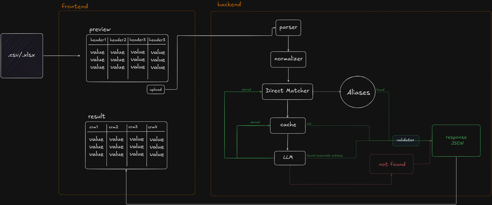

<p align="center">
  
</p>

# GrowEasy CSV

GrowEasy CSV is an AI-assisted CSV import system that accepts arbitrary CSV/XLSX files, automatically maps columns to a standardized schema, validates and normalizes data, provides a preview before import, and exports a clean, standardized dataset.

## Project Structure

```
GrowEasyCSV/
├── frontend/   # Next.js application
└── backend/    # Express + TypeScript API
```

## Features

- Intelligent AI-powered column mapping
- Automatic validation and normalization
- Preview before import
- Standardized CSV export
- Cached mappings for faster subsequent imports
- Modular frontend and backend architecture

## Tech Stack

| Frontend     | Backend             |
| ------------ | ------------------- |
| Next.js      | Express             |
| React        | TypeScript          |
| TypeScript   | AI SDK              |
| Tailwind CSS | CSV/XLSX Processing |

## Running the Project

### Backend

```bash
cd backend
npm install
npm run dev
```

Server runs on `http://localhost:3001`.

### Frontend

```bash
cd frontend
npm install
npm run dev
```

Application runs on `http://localhost:3000`.

## Notes

The repository is organized into two independent applications:

- `frontend/` contains the user interface.
- `backend/` contains the parsing, AI mapping, validation, and export services.

Refer to the individual README files inside each directory for implementation details.
