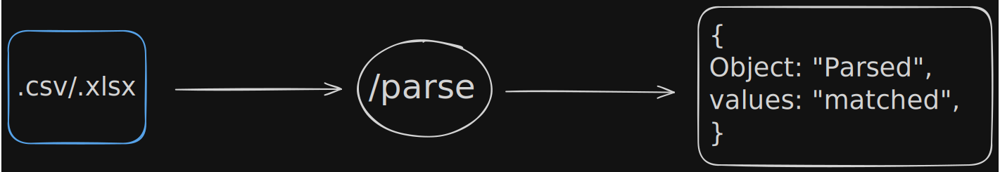

<p align="center">
  
</p>

# CSV Mapping Backend

Backend service for the AI-powered CSV Mapping application. It accepts CSV/XLSX files, parses and normalizes the data, intelligently maps user-provided headers to a standardized CRM schema, caches inferred mappings for faster subsequent requests, and returns validated CRM-ready records.

## Features

- Upload and parse CSV and Excel files
- Automatic header normalization
- Rule-based header matching for common fields
- AI-assisted mapping for unknown headers
- Redis-backed caching of inferred mappings
- CRM schema normalization
- Record validation before returning results
- REST API for frontend integration

## Tech Stack

- Node.js
- Express
- TypeScript
- Multer
- Redis
- OpenRouter API
- CSV/XLSX Parsing

## Project Structure

```
src/
├── normalizers/
├── parsers/
├── routes/
├── services/
│   ├── ai/
│   └── cache/
├── utils/
├── server.ts
```

## Getting Started

## Running the project

Development

```bash
npm run dev
```

Production

```bash
npm run build
npm start
```

## API

### POST `/parse`

Uploads a CSV or Excel file and returns standardized CRM records.

#### Request

Content-Type

```
multipart/form-data
```

Form Data

| Key  | Type                     | Required |
| ---- | ------------------------ | -------- |
| file | File (.csv, .xlsx, .xls) | Yes      |

#### Successful Response

```json
{
  "success": true,
  "mapping": {
    "Full Name": "name",
    "Work Email": "email",
    "Company": "company"
  },
  "rows": [
    {
      "name": "John Doe",
      "email": "john@example.com",
      "company": "OpenAI"
    }
  ],
  "cacheHit": false
}
```

#### Error Response

```json
{
  "success": false,
  "message": "Unable to process the uploaded file."
}
```

## Processing Pipeline

```
File Upload
      │
      ▼
Parser
      │
      ▼
Normalization
      │
      ▼
Header Matching
      │
      ├───────────────► Redis Cache
      │                     │
      │                     ▼
      │                Cached Mapping
      │
      ▼
AI Header Mapping
      │
      ▼
Merge Mapping
      │
      ▼
CRM Normalization
      │
      ▼
Validation
      │
      ▼
Response
```

## Caching

Unknown headers are fingerprinted and stored in Redis after AI inference. Subsequent uploads containing the same header set are served directly from cache, reducing latency and minimizing LLM usage.

## Validation

Before returning records, each mapped row is validated against the CRM schema to ensure only valid entries are included in the final response.
